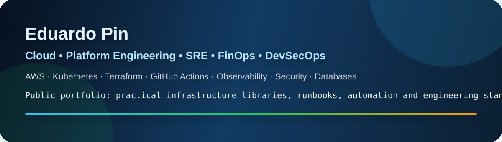
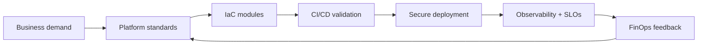

  

  
  
  
  

## Executive signal

I lead and build infrastructure platforms with a strong bias toward **reliability, cost control, security, automation and developer enablement**.

This GitHub is organized as a public utility portfolio: practical AWS IaC modules, SRE runbooks, DevSecOps pipelines, FinOps automation and platform engineering standards. It intentionally avoids employer code, private architecture, credentials and customer data.

## Portfolio map

| Area | Repository | What a recruiter or engineering leader should see |
|---|---|---|
| AWS IaC | [`aws-iac-enterprise-library`](https://github.com/eduardopin/aws-iac-enterprise-library) | 50 Terraform module starters for common AWS resources, examples, workflows and module catalog. |
| Platform Engineering | [`platform-engineering-toolbox`](https://github.com/eduardopin/platform-engineering-toolbox) | Golden paths, service templates, standards and developer enablement patterns. |
| SRE | [`sre-ops-runbooks`](https://github.com/eduardopin/sre-ops-runbooks) | SLOs, incident response, postmortems, operational readiness and runbook templates. |
| FinOps | [`finops-cloud-automation`](https://github.com/eduardopin/finops-cloud-automation) | Cost governance, tagging, scheduled shutdown, rightsizing and AWS cost review patterns. |
| DevSecOps | [`devsecops-pipeline-templates`](https://github.com/eduardopin/devsecops-pipeline-templates) | GitHub Actions, IaC scanning, container scanning, secret safety and policy-as-code. |

## Operating model

## Technical focus

<table>
<tr>
<td valign="top" width="33%">

### Cloud & Platform

- AWS infrastructure
- EKS / ECS / Kubernetes
- Terraform modules
- GitHub Actions
- Golden paths
- Developer experience

</td>
<td valign="top" width="33%">

### Reliability & Operations

- SLOs and error budgets
- Incident response
- Runbooks
- Observability
- MTTR reduction
- Operational readiness

</td>
<td valign="top" width="33%">

### Governance

- DevSecOps
- IAM and secrets
- FinOps
- Cost allocation
- Compliance evidence
- Vendor / MSP governance

</td>
</tr>
</table>

## Public portfolio rules

- No proprietary employer code.
- No credentials or internal hostnames.
- No customer data.
- No production diagrams copied from private environments.
- Public examples are sanitized, reusable and educational.

## Quick reviewer path

Start here: [`aws-iac-enterprise-library`](https://github.com/eduardopin/aws-iac-enterprise-library).  
It is the main technical repository and should be reviewed first.
